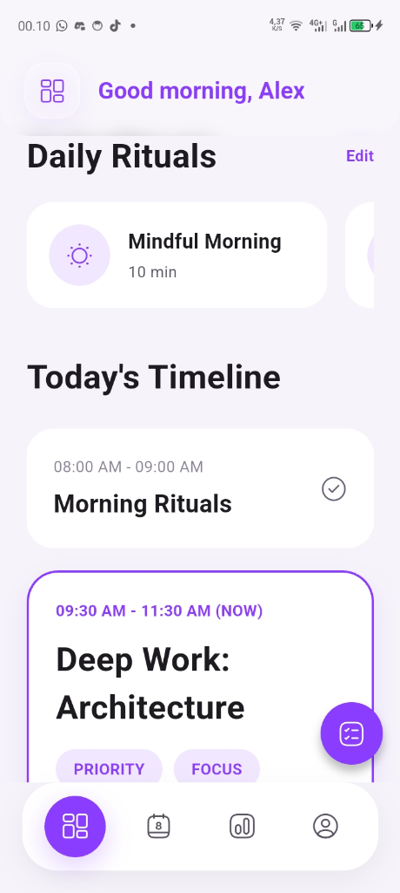
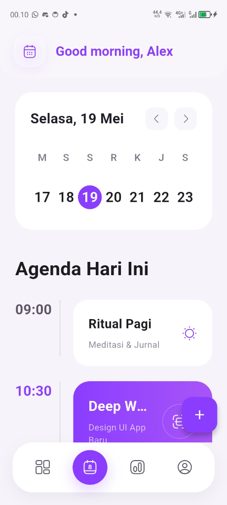
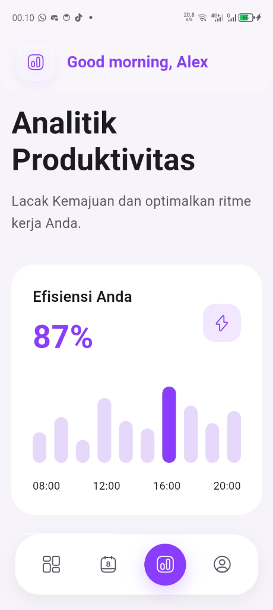
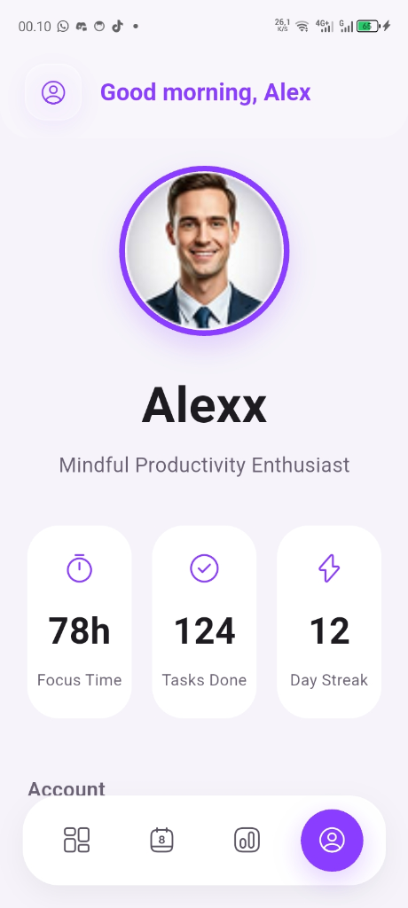
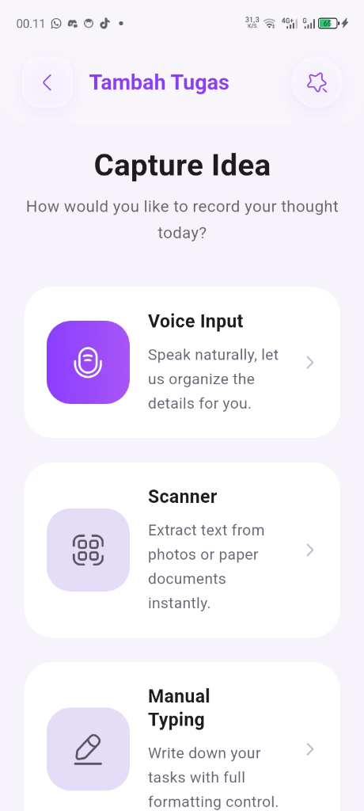

Berikut adalah tampilan antarmuka (UI) dari aplikasi seluler **ADHD Planner**:

### 1. Halaman Beranda (Daily Rituals & Timeline)

Menampilkan sapaan personal serta daftar ritual harian seperti _Mindful Morning_ dan lini masa aktivitas (_Today's Timeline_) untuk membantu pengguna fokus pada tugas-tugas prioritas.

---

### 2. Kalender & Agenda Hari Ini

Halaman agenda interaktif yang terintegrasi dengan kalender mingguan untuk memudahkan penelusuran jadwal aktivitas harian secara terorganisir.

---

### 3. Analitik Produktivitas

Menyajikan visualisasi data efisiensi harian pengguna dalam bentuk diagram batang untuk melacak kemajuan kerja dan mengoptimalkan ritme harian.

---

### 4. Profil Pengguna & Statistik

Menampilkan informasi profil pengguna beserta ringkasan statistik produktivitas seperti total waktu fokus (_Focus Time_), jumlah tugas selesai (_Tasks Done_), dan _Day Streak_.

---

### 5. Capture Idea (Tambah Tugas)

Fitur inovatif untuk menangkap ide atau membuat tugas baru dengan tiga pilihan metode input: input suara (_Voice Input_), pemindaian gambar (_Scanner_), dan pengetikan manual (_Manual Typing_).

