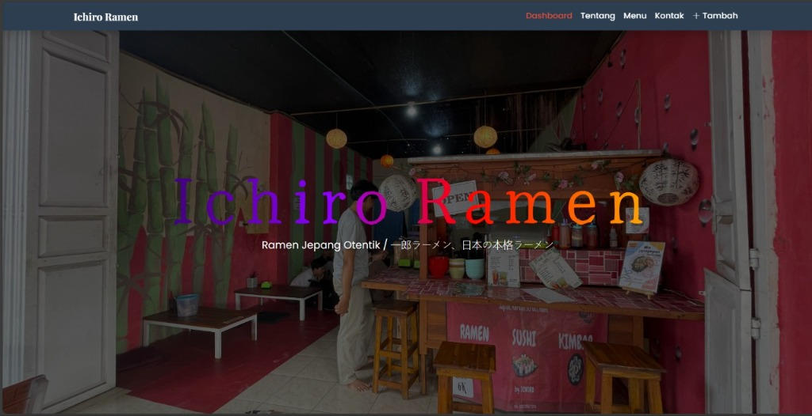
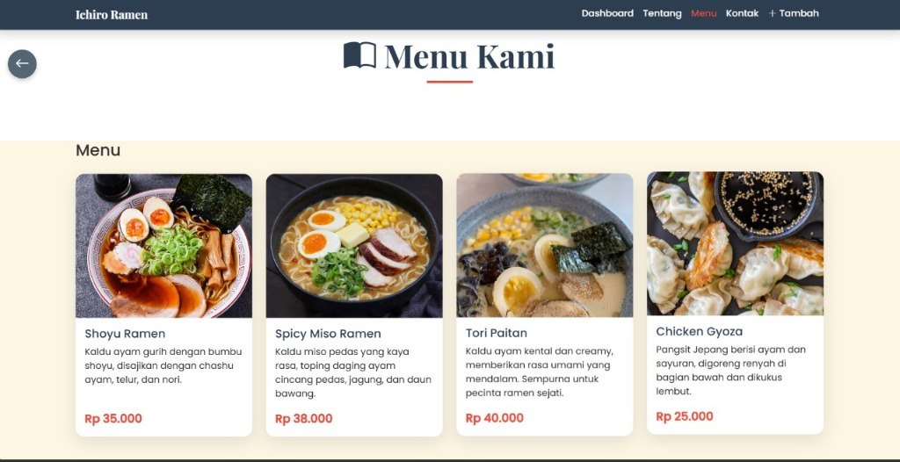
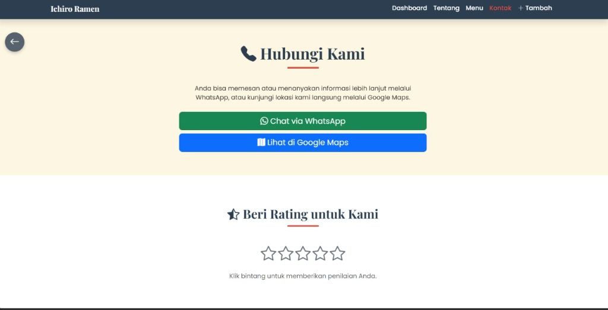

Berikut adalah tampilan antarmuka (UI) dari website **Ichiro Ramen**:

### 1. Halaman Beranda (Home Page)
Menampilkan visual restoran ramen Jepang otentik dengan tagline utama.

---

### 2. Halaman Menu
Menampilkan daftar menu makanan dan minuman yang tersedia beserta informasi harga.

---

### 3. Halaman Hubungi Kami (Contact Page)
Halaman untuk mempermudah pelanggan menghubungi restoran melalui WhatsApp, melihat lokasi di Google Maps, atau memberikan penilaian.

