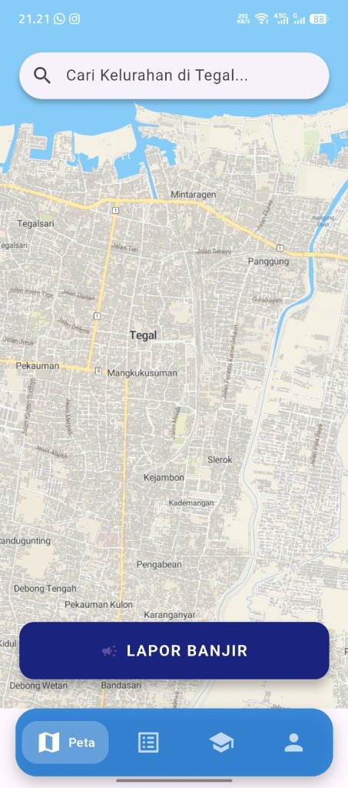
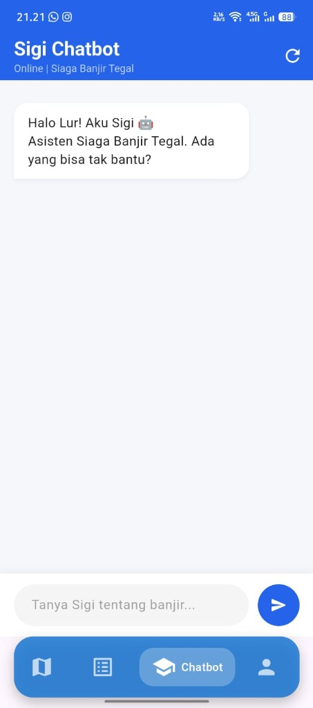
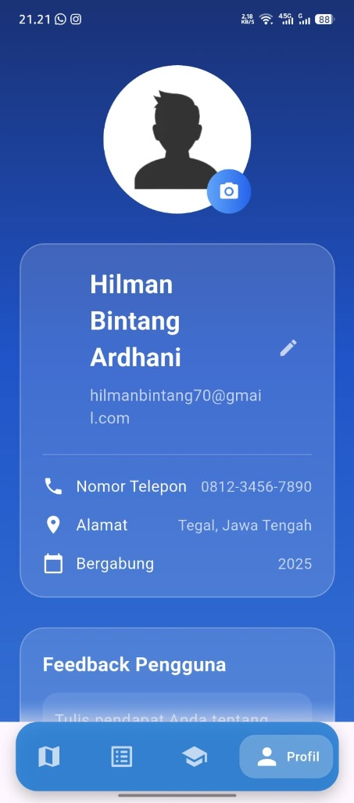

Berikut adalah tampilan antarmuka (UI) dari aplikasi seluler **Pelaporan Banjir & Sigi Chatbot**:

### 1. Halaman Peta (Lapor Banjir)
Peta interaktif wilayah Tegal yang dilengkapi dengan kolom pencarian kelurahan serta tombol utama untuk melaporkan kejadian banjir.

---

### 2. Sigi Chatbot (Asisten Siaga Banjir)
Fitur asisten cerdas berbasis chatbot yang siap membantu memberikan informasi seputar kesiapsiagaan bencana banjir di daerah Tegal.

---

### 3. Halaman Profil Pengguna
Menampilkan data diri pengguna terdaftar, nomor telepon, alamat, serta formulir masukan (feedback).

